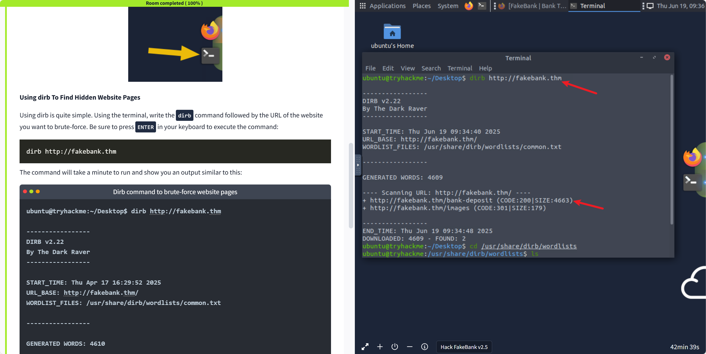

# 🏦 TryHackMe: FakeBank v2.5 通关记录

📅 日期：2025-06-19  
🔒 类型：Web 安全 / 权限绕过 / 页面爆破  
🧰 工具：dirb、浏览器（Kali AttackBox）  
🟢 状态：已完成 ✅  

---

## 🎯 任务目标

通过信息收集 + 工具使用，模拟攻击一个虚拟银行网站 FakeBank，找出隐藏页面并控制账户金额，实现“非法打款”。

---

## ✅ Task 1：What is Offensive Security?

- 攻击性安全（Offensive Security）强调模拟攻击者的行为方式，主动发现系统漏洞。
- Pentester（渗透测试员）角色常使用该方法进行企业安全评估。

---

## ✅ Task 2：使用 `dirb` 枚举隐藏页面

### 🔍 执行命令

```bash
dirb http://fakebank.thm

扫描结果
+ http://fakebank.thm/bank-deposit (CODE:200|SIZE:4663)
+ http://fakebank.thm/images       (CODE:301|SIZE:179)

访问第一个隐藏页面并注资

页面不显示

